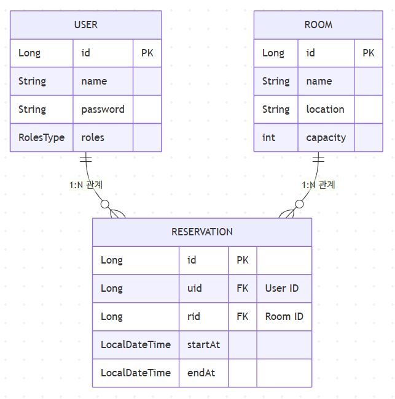
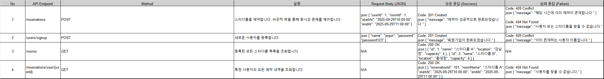

Spring Boot와 JPA를 기반으로 한 간단한 스터디룸 예약 시스템

## ✨ 주요 기능

-   사용자, 스터디룸, 예약의 기본 CRUD 기능
-   특정 시간에 하나의 스터디룸은 한 명의 사용자만 예약 가능
-   **동시 예약 요청에 대한 데이터 정합성 보장 (Pessimistic Lock 활용)**

---

## 🛠️ 기술 스택

-   **Backend**: Java 17, Spring Boot 3.3.4, Spring Data JPA, Lombok
-   **Database**: MySQL 8.0
-   **Build Tool**: Gradle 8.7
-   **Containerization**: Docker, Docker Compose

### 사전 요구 사항

-   [Docker Desktop](https://www.docker.com/products/docker-desktop/)이 설치되어 있어야 합니다.

### 실행 방법

1.  **프로젝트 클론**
    ```bash
    git clone [https://github.com/pojun406/getStudyRoom.git](https://github.com/pojun406/getStudyRoom.git)
    ```

2.  **프로젝트 디렉토리로 이동**
    ```bash
    cd getStudyRoom
    ```

3.  **Docker Compose를 이용한 실행**
    아래 명령어를 실행하면 Gradle 빌드, Docker 이미지 생성, DB 컨테이너 및 애플리케이션 컨테이너 실행이 한번에 이루어집니다.

    ```bash
    docker-compose up --build
    ```
    정상적으로 실행되면 `study_room_app`과 `study_room_db` 두 개의 컨테이너가 실행됩니다.

4.  **애플리케이션 확인**
    -   애플리케이션은 `http://localhost:8080`에서 실행됩니다.
    -   데이터베이스는 `localhost:3306`에서 접속할 수 있습니다.

## DB ERD
### 관계 설명
- 사용자 (USER) ↔ 예약 (RESERVATION) : 1 : N (일대다 관계)
- 한 명의 사용자는 여러 개의 예약을 할 수 있습니다.
- 하나의 예약은 반드시 한 명의 사용자에 속합니다.
<br><br>
- 스터디룸 (ROOM) ↔ 예약 (RESERVATION) : 1 : N (일대다 관계)
- 하나의 스터디룸은 여러 시간대에 걸쳐 예약될 수 있습니다.
- 하나의 예약은 반드시 하나의 스터디룸에만 해당합니다.



## API 명세서
### 4가지 요구사항에 맞춰 작성
- **회의실 등록 (ADMIN 전용)**

    `POST /rooms` : 이름/위치/수용인원 등록

- **가용성 조회**

  `GET /rooms?date=YYYY-MM-DD` : 해당 날짜 예약 현황/빈 시간대 조회

- **예약 생성 (USER)**

  `POST /reservations` : `roomId`, `startAt`, `endAt`

  → **시간 겹침 불가** (동일 방/겹치는 구간 금지)

- **예약 취소 (OWNER or ADMIN)**

  `DELETE /reservations/{id}`
<br><br><br><br>

## 🤖 LLM 활용 내역
### 1. 동시성 테스트 코드 디버깅
- 구간: ReservationControllerTest의 동시성 테스트 케이스 작성 중
  <br><br>
- 문제: 여러 스레드에서 동시에 예약을 시도할 때 Detached entity passed to persist 예외가 발생.
  <br><br>
- 사용한 프롬프트: "Spring Boot 테스트 환경에서 여러 스레드를 사용해 API를 동시 호출하는 테스트 코드를 작성했는데, Detached entity passed to persist 에러가 발생한다. 원인과 해결 방법을 알려줘."
  <br><br>
- 해결: LLM은 트랜잭션의 생명주기와 영속성 컨텍스트의 분리로 인해 발생하는 문제임을 설명하고, 테스트 설정 단계(@BeforeEach)에 @Transactional(propagation = Propagation.REQUIRES_NEW)를 적용하여 문제를 해결하는 방안을 제시했습니다.
  <br><br>
### 2. Docker Compose 환경 설정 및 오류 해결
- 구간: Dockerfile 및 docker-compose.yml을 이용한 애플리케이션 컨테이너화 과정
   <br><br>
- 문제 1: docker-compose up 실행 시, Spring Boot 컨테이너 내부에서 다시 docker-compose 명령어를 실행하려다 No Docker Compose file found 에러 발생.
  <br><br>
- 사용한 프롬프트: "Docker 컨테이너 안에서 docker-compose up이 실행되며 발생하는 에러를 해결해줘."
  <br><br>
- 해결: spring-boot-docker-compose 의존성의 자동 설정 기능이 원인임을 파악하고, docker-compose.yml의 environment에 SPRING_DOCKER_COMPOSE_ENABLED=false 옵션을 추가하여 문제를 해결했습니다.
  <br><br>
- 문제 2: Spring Boot 앱이 MySQL 컨테이너에 접속하지 못하고 Public Key Retrieval is not allowed 및 Access denied for user 에러 발생.
<br><br>
- 사용한 프롬프트: "Access denied 에러가 계속 발생한다. docker-compose.yml 설정을 검토하고 원인과 해결 방법을 알려줘."
  <br><br>
- 해결: LLM은 MySQL 8.0의 기본 인증 방식 변경(caching_sha2_password)이 근본 원인임을 지적했습니다. 이에 대한 해결책으로 docker-compose.yml의 db 서비스에 command: --default-authentication-plugin=mysql_native_password 옵션을 추가하여 인증 방식을 변경하고, app 서비스의 SPRING_DATASOURCE_PASSWORD 환경 변수 오타를 수정하는 등 종합적인 해결책을 제시받았습니다. 또한, 설정 변경 후에는 docker-compose down -v 명령어로 기존 볼륨을 완전히 삭제해야 한다는 중요한 팁을 얻었습니다.

### 3. 프로젝트 README.md 문서 자동 생성
- 구간: 프로젝트 마무리 및 GitHub 문서화
  <br><br>
- 사용한 프롬프트: "이 프로젝트(GitHub 링크 제공)를 보고 도커 실행 방법부터 어떤 로직(동시성 제어)을 사용했는지까지 상세하게 README.md 파일을 작성해줘."
  <br><br>
- 결과: 프로젝트의 전반적인 구조, 기술 스택, ERD(Mermaid 다이어그램 포함), 핵심 로직인 비관적 락에 대한 상세한 설명, 그리고 Docker 기반의 실행 방법까지 포함된 전문적인 README.md 초안을 생성하여 문서 작성 시간을 크게 단축했습니다.